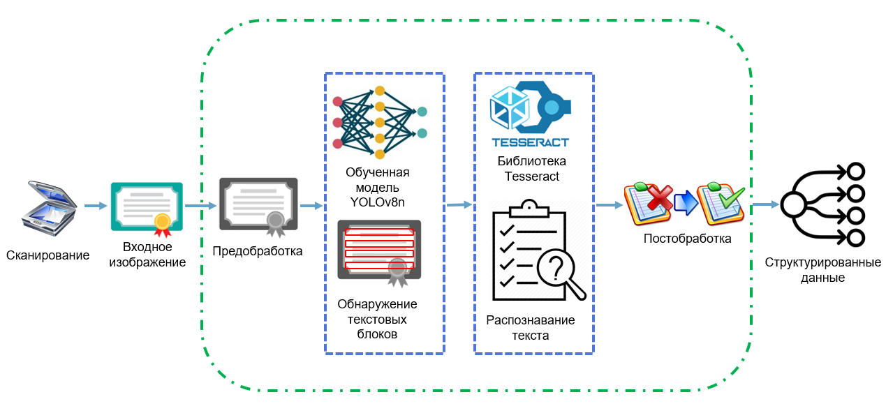

# Репозиторий магистерской ВКР: 
*Разработка системы распознавания информации из удостоверений о повышении квалификации с использованием алгоритмов искусственного интеллекта* (2025)

## 🖼️ Архитектура системы



 
## 📁 Структура репозитория

### 🖥️ Основное приложение
- `app/main.py` - Главный скрипт системы. Организует полный цикл обработки документа.
- `app/main.py` - Веб-приложение
- app/evaluate.py – Модуль оценки качества распознавания CER.
- `app/modules/` - Модули обработки:
  - `preprocessing.py` - Модуль предварительной обработки изображений.
  - `detection.py` - Модуль детекции текстовых блоков (YOLOv8).
  - `postprocessing.py` - Модуль постобработки текста.
- `app/model/` - Модели:
  - `pretrained_model_yolo8n.pt` - Предобученные веса модели YOLOv8 для детекции текстовых блоков.
- `app/img/` - Тестовые изображения документов.
- `app/modules/organisations.json` - База данных организаций с полными названиями и аббревиатурами.

### 🔬 Эксперименты
- `experiments/` - Ноутбуки исследований:
  - `yolov8n_training.ipynb` - Jupyter-ноутбук с процессом обучения модели детекции YOLOv8 nano.
  - `ssd300_training.ipynb` - Jupyter-ноутбук с процессом обучения модели детекции SSD300_VGG16.
  - `tesseract_exp.ipynb` - Jupyter-ноутбук с процессом тестирования точности Tesseract OCR.
  - `EasyOCR_exp.ipynb` - Jupyter-ноутбук с процессом тестирования точности EasyOCR.
  - `yolov8n_exp_preproceccing.ipynb` - Jupyter-ноутбук с процессом cравнения метрик обнаружения текстовых блоков YOLOv8 nano без/с предобработкой изображений

### 🗃️ Данные
- `data/` - Примеры документов:
  - `kpk1.jpg` - тестовое удостоверение 1.
  - `kpk2.png` - тестовое удостоверение 2.

## 🛠 Зависимости
- Python 3.8+
- Ultralytics (YOLOv8)
- OpenCV, Tesseract, EasyOCR
- Jupyter Notebook

Установка:
```bash
pip install -r requirements.txt

